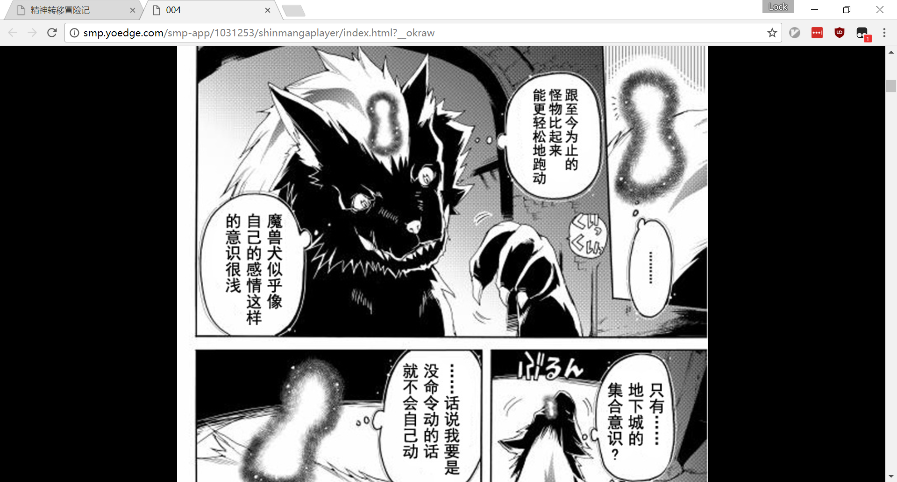

# yoedge-horizontal-screen

实现灰机汉化组漫画网站（yoedge.com）的横屏阅读模式，<u>**仅适用于电脑端**</u>

# 简介

大部分漫画软件都会提供竖屏与横屏两种阅读模式，竖屏有更好的全局感，而横屏则可以更仔细地看清漫画细节和对话。条漫用竖屏非常合适，但一般的漫画个人更喜欢横屏阅读。

灰机的漫画网站为了实现跨平台和动态漫画，自己做了一个播放器渲染漫画，只提供竖屏模式，字体很小，而且不能正常缩放，让我看漫画时觉得非常吃力。

于是我编写了这个脚本，实现了漫画的横屏显示，更好地利用了屏幕空间，而且一次性加载所有漫画，免去了翻页和等待，此外，还定制了部分快捷键，让观看更加便捷。

下图为显示效果，看对话方便了许多：

# 安装

1. 安装脚本执行插件

   脚本需要通过浏览器插件执行，可以选择安装[Greasemonkey](https://addons.mozilla.org/zh-cn/firefox/addon/greasemonkey/)或者[Tampermonkey](http://tampermonkey.net/)，Greasemonkey适用于Firefox，Tampermonkey适用于Chrome、Microsoft Edge、Safari、Opera Next和Firefox。

   （Tampermonkey官网上Chrome版的安装链接指向Chrome Web Store，在中国大陆无法访问，可自行搜索对应的.crx文件安装，另外采用Chrome内核的360浏览器、搜狗浏览器等，也可在相应的应用中心搜索Tampermonkey安装）

2. 安装脚本

   进入Greasy Fork上该脚本的[主页](https://greasyfork.org/zh-CN/scripts/28767-yoedge-horizontal-screen)，点击“安装此脚本”。

安装完成后，再进入灰机汉化组的网站看漫画，就会以横屏模式显示。

附：[灰机汉化组贴吧](https://tieba.baidu.com/f?kw=%E7%81%B0%E6%9C%BA%E6%B1%89%E5%8C%96%E7%BB%84&ie=utf-8)

# 功能介绍

1. **横屏显示**：类似手机上的横屏阅读，但并没有做成与屏幕等宽，而是把漫画设为屏幕宽度的60%，兼顾全局观感与细节阅读

2. **漫画一次性加载**：去除原有的播放器，一次性加载所有漫画原图，无需翻页与等待，支持图片右键另存

3. **灵活缩放**：添加图片缩放功能，最大与屏幕等宽，最小与屏幕等高（屏幕刚好够放一张图，即原本的竖屏模式），缩放清晰度取决于图源本身

4. **自定义快捷键**：

   | 按键    | 功能             |
   | :---- | :------------- |
   | =/-/0 | 放大/缩小/恢复默认缩放大小 |
   | j/k   | 视图区域下移/上移      |
   | h/l   | 滚动到顶部/滚动到底部    |
   | n     | 下一话            |

   快捷键全部定义在右手区域，单手即可完成所有浏览行为，相对用鼠标操作来说更轻松便捷

# 注意事项

* **平滑滚动兼容**

  当前所用的平滑滚动只有Firefox、Chrome、Opera支持，其中只有Firefox默认开启，后两者需要在浏览器地址栏输入chrome://flags/#enable-experimental-web-platform-features然后激活此项，否则虽然能正常滚动，但没有平滑效果。（不使用j/k快捷键的话可忽略）

* **反色区域问题**

  灰机的漫画源图中存在梯形的反色区域，平时看不到是因为播放器给处理掉了，现在不加载播放器直接加载源图，于是会有反色区域，由于无法得知存在反色区域的页面和位置，本脚本无法进行相应处理，如果实在忍受不了，可以退回脚本的[1.0.5版本](https://greasyfork.org/zh-CN/scripts/28767-yoedge-horizontal-screen?version=191401)使用，该版本保留播放器，但只能一页一页看。

# 致谢 

本脚本的核心代码参考了[FeiLong](https://greasyfork.org/zh-CN/users/28687-feilong)的脚本【[飞机汉化](https://greasyfork.org/zh-CN/scripts/24749-%E9%A3%9E%E6%9C%BA%E6%B1%89%E5%8C%96)】，在此致谢。